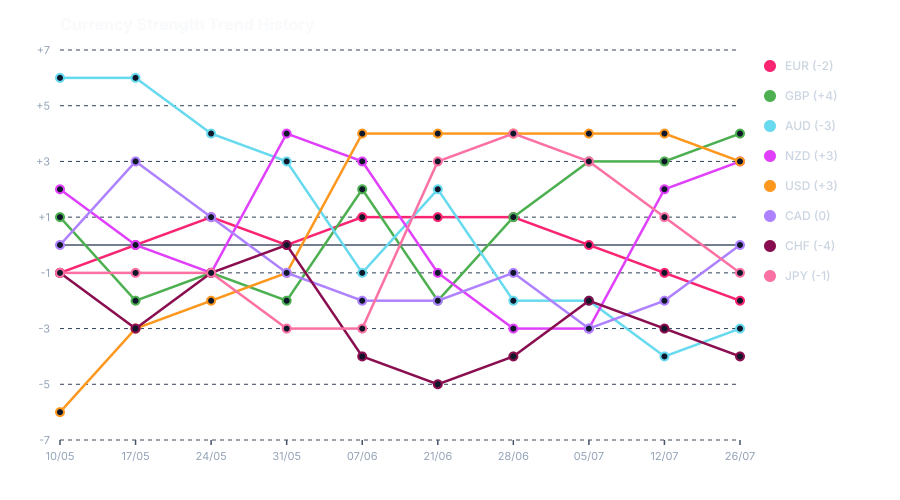

# Currency Strength Tracker

Weekly currency strength meter readings and trend analysis compiled from marketsmadeclear.com.

## Latest Readings (Week of 2026-07-26)

| Currency | Score | Trend Bias |
| :--- | :--- | :--- |
| **GBP** | +4 | Strongly Bullish |
| **NZD** | +3 | Strongly Bullish |
| **USD** | +3 | Strongly Bullish |
| **CAD** | 0 | Neutral |
| **JPY** | -1 | Mildly Bearish |
| **EUR** | -2 | Mildly Bearish |
| **AUD** | -3 | Bearish |
| **CHF** | -4 | Strongly Bearish |

## Suggested Pairs to Trade (Week of 2026-07-26)

- **Possible Trending Buys**: [[GBPAUD]], [[GBPCHF]], [[GBPJPY]], [[NZDCHF]], [[NZDJPY]], [[USDCHF]], [[USDJPY]]
- **Possible Trending Sells**: [[AUDUSD]], [[AUDNZD]]
- **Possible Counter Trend Buys**: [[AUDNZD]], [[AUDUSD]]
- **Possible Counter Trend Sells**: [[GBPAUD]], [[GBPCHF]], [[GBPJPY]], [[NZDCHF]], [[NZDJPY]], [[USDCHF]], [[USDJPY]]

## Sources

- [Markets Made Clear CSM](https://www.marketsmadeclear.com/Resources/Currency-Strength/Currency-Strength-Meter.aspx)
