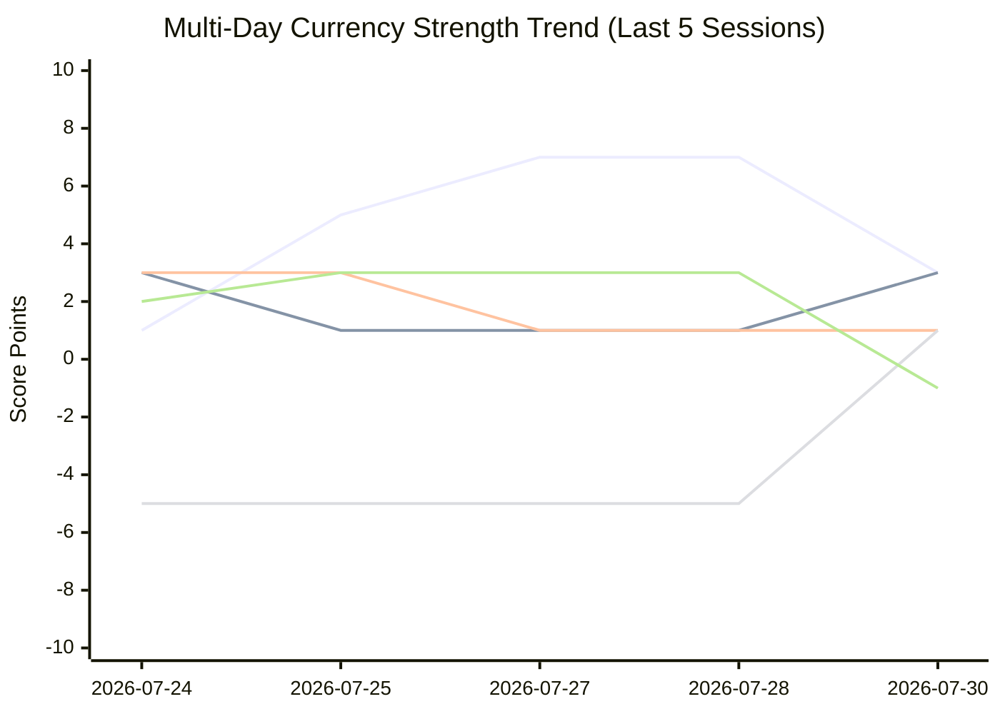

# Daily Trading Brief — 2026-07-30

### 🔍 Changes from Yesterday

| Symbol | TAT Trend Bar | Market Structure | TAT Signal | Price |
| :--- | :---: | :---: | :--- | :--- |
| **SGX:SCY** | 🔴 Bearish ➔ 🟢 Bullish | **Expand** | ↓LBear | 1.634 |
| **SGX:DHLU** | 🔴 Bearish ➔ 🟢 Bullish | **Bearish** | ↑SBull | 0.48 |
| **SGX:M44U** | 🔴 Bearish ➔ 🟢 Bullish | **Squeeze** | ⬤OptBull | 1.24 |
| **SGX:N01** | 🟢 Bullish ➔ 🔴 Bearish | **Expand** | ⬤OptBull | 0.185 |
| **SGX:LJ3** | 🔴 Bearish ➔ 🟢 Bullish | **Bearish** | LBull | 1 |
| **SGX:U11** | 🟢 Bullish ➔ 🔴 Bearish | **Bullish** | LBull | 43.89 |

---

## Symbol Analysis

| Symbol | TAT Trend Bar | Market Structure | TAT Signal | Price |
| :--- | :---: | :---: | :--- | :--- |
| **EIGHTCAP:EURAUD** | 🔴 Bearish | **Bullish** | LBull | 1.64799 |
| **EIGHTCAP:GBPAUD** | 🟢 Bullish | **Bullish** | ↓LBear | 1.92084 |
| **EIGHTCAP:AUDNZD** | 🔴 Bearish | **Bearish** | ⬤OptBull | 1.19906 |
| **EIGHTCAP:EURNZD** | 🟢 Bullish | **Expand** | ⬤OptBear | 1.97616 |
| **EIGHTCAP:GBPNZD** | 🟢 Bullish | **Bullish** | ⬤OptBear | 2.30342 |
| **EIGHTCAP:EURGBP** | 🔴 Bearish | **Expand** | ⬤OptBull | 0.85786 |
| **EIGHTCAP:AUDCAD** | 🟢 Bullish | **Bearish** | ⬤OptBear | 0.97684 |
| **EIGHTCAP:NZDCAD** | 🟢 Bullish | **Expand** | ⬤OptBull | 0.81449 |
| **EIGHTCAP:GBPCAD** | 🔴 Bearish | **Expand** | SBear | 1.87652 |
| **EIGHTCAP:EURCAD** | 🔴 Bearish | **Squeeze** | ⬤OptBull | 1.60998 |
| **EIGHTCAP:USDCAD** | 🔴 Bearish | **Bullish** | SBear | 1.40366 |
| **EIGHTCAP:AUDJPY** | 🟢 Bullish | **Bearish** | ⬤OptBull | 113.685 |
| **EIGHTCAP:NZDJPY** | 🟢 Bullish | **Expand** | ⬤OptBull | 94.8 |
| **EIGHTCAP:EURJPY** | 🟢 Bullish | **Bearish** | ⬤OptBull | 187.376 |
| **EIGHTCAP:GBPJPY** | 🟢 Bullish | **Expand** | SBear | 218.407 |
| **EIGHTCAP:USDJPY** | 🟢 Bullish | **Bullish** | ⬤OptBull | 163.348 |
| **EIGHTCAP:CADJPY** | 🔴 Bearish | **Bearish** | ⬤OptBear | 116.369 |
| **EIGHTCAP:CHFJPY** | 🟢 Bullish | **Squeeze** | SBear | 200.733 |
| **EIGHTCAP:CADCHF** | 🟢 Bullish | **Squeeze** | ↓LBear | 0.57961 |
| **EIGHTCAP:USDCHF** | 🟢 Bullish | **Bullish** | ⬤OptBull | 0.81361 |
| **EIGHTCAP:AUDCHF** | 🔴 Bearish | **Expand** | SBear | 0.56619 |
| **EIGHTCAP:NZDCHF** | 🟢 Bullish | **Expand** | ⬤OptBull | 0.4722 |
| **EIGHTCAP:EURCHF** | 🔴 Bearish | **Expand** | ↑SBull | 0.9333 |
| **EIGHTCAP:GBPCHF** | 🟢 Bullish | **Bullish** | ⬤OptBull | 1.08784 |
| **EIGHTCAP:EURUSD** | 🟢 Bullish | **Bullish** | ↓LBear | 1.14699 |
| **EIGHTCAP:GBPUSD** | 🔴 Bearish | **Expand** | ⬤OptBull | 1.33696 |
| **EIGHTCAP:AUDUSD** | 🟢 Bullish | **Bearish** | ⬤OptBull | 0.69591 |
| **EIGHTCAP:NZDUSD** | 🟢 Bullish | **Bearish** | LBull | 0.58023 |
| **EIGHTCAP:XAUUSD** | 🟢 Bullish | **Squeeze** | ↑SBull | 4091.06 |
| **EIGHTCAP:XAGUSD** | 🟢 Bullish | **Bearish** | ↓LBear | 58.251 |
| **EIGHTCAP:USOUSD** | 🔴 Bearish | **Bearish** | ↓LBear | 85.028 |
| **EIGHTCAP:AUDSGD** | 🟢 Bullish | **Bearish** | LBull | 0.89672 |
| **EIGHTCAP:NZDSGD** | 🟢 Bullish | **Bearish** | ⬤OptBear | 0.74771 |
| **EIGHTCAP:EURSGD** | 🟢 Bullish | **Bearish** | ⬤OptBull | 1.47811 |
| **EIGHTCAP:GBPSGD** | 🟢 Bullish | **Expand** | LBull | 1.7229 |
| **EIGHTCAP:USDSGD** | 🔴 Bearish | **Bullish** | ⬤OptBear | 1.28867 |
| **EIGHTCAP:USDCNH** | 🔴 Bearish | **Expand** | ⬤OptBear | 6.75958 |
| **FX_IDC:JPYCNH** | 🔴 Bearish | **Bearish** | ⬤OptBear | 0.041345 |
| **EIGHTCAP:AUDCNH** | 🟢 Bullish | **Bearish** | ⬤OptBear | 4.70205 |
| **TVC:DXY** | 🔴 Bearish | **Bearish** | SBear | 100.803 |
| **EIGHTCAP:ASX200** | 🔴 Bearish | **Bullish** | ⬤OptBull | 8979.28 |
| **FOREXCOM:EU50** | 🔴 Bearish | **Expand** | SBear | 6242.17 |
| **EIGHTCAP:JPN225** | 🟢 Bullish | **Bullish** | ⬤OptBear | 61463.5 |
| **PEPPERSTONE:GER40** | 🔴 Bearish | **Bullish** | ⬤OptBull | 25373.7 |
| **EIGHTCAP:NDQ100** | 🟢 Bullish | **Squeeze** | ⬤OptBull | 27329.39 |
| **EIGHTCAP:SPX500** | 🟢 Bullish | **Bullish** | ⬤OptBull | 7343.01 |
| **AMEX:SPY** | ⚪ Neutral | **Bearish** | ⬤OptBull | 729.46 |
| **EIGHTCAP:US2000** | 🟢 Bullish | **Bullish** | SBear | 2904.53 |
| **EIGHTCAP:US30** | 🟢 Bullish | **Bullish** | SBear | 51753.87 |
| **HSI:HSI** | 🔴 Bearish | **Bearish** | LBull | 25807.92 |
| **EIGHTCAP:HK50** | 🔴 Bearish | **Expand** | LBull | 25942.17 |
| **HSI:HSTECH** | 🔴 Bearish | **Squeeze** | ↑SBull | 4864.73 |
| **EIGHTCAP:CN50** | 🟢 Bullish | **Bearish** | ↑SBull | 14877.86 |
| **NASDAQ:QQQ** | 🔴 Bearish | **Squeeze** | ⬤OptBull | 661.73 |
| **AMEX:GLD** | 🟢 Bullish | **Squeeze** | ↓LBear | 371.08 |
| **AMEX:SLV** | 🟢 Bullish | **Bearish** | ↓LBear | 51.77 |
| **NASDAQ:TSLA** | 🟢 Bullish | **Bearish** | ⬤OptBear | 298.32 |
| **NASDAQ:NVDA** | 🟢 Bullish | **Bearish** | ↑SBull | 190.01 |
| **NASDAQ:MSFT** | 🔴 Bearish | **Bearish** | ↓LBear | 390.54 |
| **NASDAQ:META** | 🔴 Bearish | **Expand** | ↑SBull | 585.61 |
| **NASDAQ:AAPL** | 🟢 Bullish | **Bearish** | LBull | 338.19 |
| **NASDAQ:AMZN** | 🟢 Bullish | **Bearish** | ⬤OptBear | 226.65 |
| **NASDAQ:GOOGL** | 🟢 Bullish | **Squeeze** | ⬤OptBear | 336.71 |
| **NASDAQ:GOOG** | 🟢 Bullish | **Squeeze** | ⬤OptBear | 335.76 |
| **NASDAQ:CLSK** | 🔴 Bearish | **Bearish** | ↓LBear | 12.01 |
| **NASDAQ:MSTR** | 🔴 Bearish | **Squeeze** | ↓LBear | 93.33 |
| **NASDAQ:RIOT** | 🔴 Bearish | **Expand** | ↓LBear | 18.24 |
| **NYSE:BMNR** | 🟢 Bullish | **Bearish** | ↑SBull | 16.59 |
| **NYSE:RERE** | 🟢 Bullish | **Bearish** | ⬤OptBear | 4.23 |
| **SGX:SCY** | 🟢 Bullish | **Expand** | ↓LBear | 1.634 |
| **SGX:DHLU** | 🟢 Bullish | **Bearish** | ↑SBull | 0.48 |
| **SGX:M44U** | 🟢 Bullish | **Squeeze** | ⬤OptBull | 1.24 |
| **SGX:ME8U** | 🔴 Bearish | **Expand** | ⬤OptBear | 1.96 |
| **SGX:558** | 🟢 Bullish | **Squeeze** | ↓LBear | 2.19 |
| **SGX:N01** | 🔴 Bearish | **Expand** | ⬤OptBull | 0.185 |
| **SGX:LJ3** | 🟢 Bullish | **Bearish** | LBull | 1 |
| **SGX:D05** | 🟢 Bullish | **Bullish** | SBear | 75 |
| **SGX:O39** | 🟢 Bullish | **Bullish** | SBear | 29.78 |
| **SGX:U11** | 🔴 Bearish | **Bullish** | LBull | 43.89 |
| **SGX:BS6** | 🟢 Bullish | **Squeeze** | ⬤OptBear | 3.89 |
| **BINANCE:BTCUSD** | 🔴 Bearish | **Bearish** | ↑SBull | 63896 |
| **BINANCE:ETHUSD** | 🔴 Bearish | **Squeeze** | ↓LBear | 1903.07 |
| **BINANCE:SOLUSD** | 🔴 Bearish | **Bullish** | ↓LBear | 73.41 |
| **BINANCE:NEARUSD** | 🔴 Bearish | **Bearish** | ⬤OptBear | 1.60643052 |
| **EIGHTCAP:BTCUSD** | 🔴 Bearish | **Bearish** | ↑SBull | 63879.5 |
| **EIGHTCAP:ETHUSD** | 🔴 Bearish | **Squeeze** | ↓LBear | 1901.85 |
| **EIGHTCAP:SOLUSD** | 🔴 Bearish | **Bullish** | ↑SBull | 73.3775 |
| **EIGHTCAP:NEARUSD** | 🔴 Bearish | **Bearish** | ⬤OptBear | 1.592 |

---

## 📊 Currency Strength Scoreboard & Multi-Day Trend Graph

This scoreboard aggregates individual currency strengths based on their **ZigZag Market Structure** (pivot combinations) across 36 forex pairs.

### 📉 Multi-Day Currency Strength Trend Graph (Score Progression)



### 🗓️ 5-Day Currency Strength Score Matrix

| Currency | 2026-07-24 | 2026-07-25 | 2026-07-27 | 2026-07-28 | 2026-07-30 | 5-Day Shift |
| :--- | :---: | :---: | :---: | :---: | :---: | :--- |
| **GBP** | +1 | +5 | +7 | +7 | +3 | 🟢 Gain (+2) |
| **NZD** | +3 | +1 | +1 | +1 | +3 | ⚪ Stable |
| **AUD** | +3 | +3 | +1 | +1 | +1 | 🔴 Loss (-2) |
| **CAD** | -5 | -5 | -5 | -5 | +1 | 🟢 Gain (+6) |
| **USD** | +2 | +3 | +3 | +3 | -1 | 🔴 Loss (-3) |
| **EUR** | +3 | +1 | +1 | +1 | -1 | 🔴 Loss (-4) |
| **CHF** | -4 | -5 | -5 | -5 | -1 | 🟢 Gain (+3) |
| **JPY** | -3 | -3 | -3 | -3 | -5 | 🔴 Loss (-2) |
### 📈 Today's Relative Strength Bar Chart

```text
GBP  | 🟩 ███ (+3)
NZD  | 🟩 ███ (+3)
AUD  | 🟩 █ (+1)
CAD  | 🟩 █ (+1)
USD  | 🟥 ░ (-1)
EUR  | 🟥 ░ (-1)
CHF  | 🟥 ░ (-1)
JPY  | 🟥 ░░░░░ (-5)
```


### 🔍 Market Structure Insights

* **Strongest**: USD (Score: 5)
* **Weakest**: AUD (Score: -8)
* **High Range Expansion (Megaphone / Undecided)**: GBP, NZD (High number of Expand structures)

### 💡 Strong vs. Weak Combinations

* **Short AUD/USD** (Score Diff: 13)
* **Long USD/CHF** (Score Diff: 7)
* **Short NZD/USD** (Score Diff: 7)
* **Long GBP/AUD** (Score Diff: 11)
* **Long GBP/CHF** (Score Diff: 5)
* **Long GBP/NZD** (Score Diff: 5)
* **Short AUD/SGD** (Score Diff: 10)
