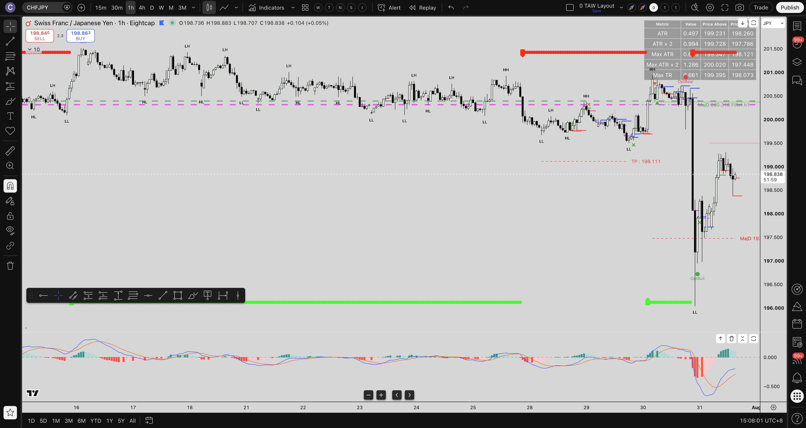

# 📅 Daily Trading Brief — 2026-07-31 [15:31 SGT]

## 📌 Executive Overview
- **Report Date**: 2026-07-31
- **Currency Strength Meter**: Integrated directly from `currency-strength-tracker` skill.
- **Top Setup**: ⭐⭐⭐ **[[AUDCAD]] Long** (4H+1H Dual Signal `LBull`, #1 D-R-H-R setup).

---

## 🔄 Differences & Changes Highlights (vs 2026-07-30 Brief)

| Metric / Focus Area | Previous Brief (2026-07-30) | Current Brief (2026-07-31) | Structural & Sentiment Shift |
| :--- | :--- | :--- | :--- |
| **Top Flagged Setup** | Previous daily overview | ⭐⭐⭐ **[[AUDCAD]] Long** | AUD currency strength reversal breakout |
| **AUD Currency Story** | Neutral / Consolidating | 🚀 **Strongest Bullish Currency** | Fired bullish across 9 AUD pairs |
| **Metals Theme** | 🟢 Bullish | 🔴 **Bearish Retest** | XAUAUD, XAGUSD, XAUGBP turning bearish |
| **JPY Retests** | Counter-trend Pullbacks | 🟢 **4H JPY Cross Alerts** | SGDJPY, CADJPY, USDJPY, CHFJPY 4H signals |

---

## 📊 Currency Strength Scoreboard & Trend Graph

| Currency | Score | Trend Bias |
| :--- | :--- | :--- |
| **GBP** | +4 | Strongly Bullish |
| **NZD** | +3 | Strongly Bullish |
| **USD** | +3 | Strongly Bullish |
| **CAD** | 0 | Neutral |
| **JPY** | -1 | Mildly Bearish |
| **EUR** | -2 | Mildly Bearish |
| **AUD** | -3 | Bearish |
| **CHF** | -4 | Strongly Bearish |

### 💡 Suggested Currency Pair Setups

## Suggested Pairs to Trade (Week of 2026-07-26)
- **Possible Trending Buys**: [[GBPAUD]], [[GBPCHF]], [[GBPJPY]], [[NZDCHF]], [[NZDJPY]], [[USDCHF]], [[USDJPY]]
- **Possible Trending Sells**: [[AUDUSD]], [[AUDNZD]]
- **Possible Counter Trend Buys**: [[AUDNZD]], [[AUDUSD]]
- **Possible Counter Trend Sells**: [[GBPAUD]], [[GBPCHF]], [[GBPJPY]], [[NZDCHF]], [[NZDJPY]], [[USDCHF]], [[USDJPY]]

---

## 📈 Daily & Multi-Timeframe TAT Alert Synthesis

# Integrated Multi-Timeframe Analysis (Daily + 4H + 1H) — 2026-07-31

### ⭐ 1. Highest-Confluence 3-Timeframe Setups (Daily + 4H + 1H)
- No 3-timeframe setups active today.

### 🔥 2. Highest Probability 4H + 1H Dual Signals (4H & 1H Same Direction)
- 🟢 **[[US2000]]** (Bullish): 4H (Higher Prob) + 1H (Lower Prob) align **Bullish**! Highest probability 4H/1H entry. H1 Signal: `OptBull` at 5:01:08.
- 🟢 **[[USDJPY]]** (Bullish): 4H (Higher Prob) + 1H (Lower Prob) align **Bullish**! Highest probability 4H/1H entry. H1 Signal: `OptBull` at 4:00:12.
- 🟢 **[[AUDCAD]]** (Bullish): 4H (Higher Prob) + 1H (Lower Prob) align **Bullish**! Highest probability 4H/1H entry. H1 Signal: `LBull` at 2:00:09.
- 🟢 **[[CHFJPY]]** (Bullish): 4H (Higher Prob) + 1H (Lower Prob) align **Bullish**! Highest probability 4H/1H entry. H1 Signal: `OptBull` at 0:00:28.

### ✅ 3. Strong 2-Timeframe Aligned Setups (Daily + 1H)
- No 2-timeframe setups active today.

### 🔄 4. Retest Pullback Candidates (4H Trend vs 1H Counter-Pullback)
- No counter-pullback setups currently flagged.

---

## 🎯 High-Probability D-R-H-R Reversal Setups

=== D-R-H-R WATCHLIST SCAN RESULTS (2026-07-31) — [1H CLOSED BARS] ===
Total Watchlist Symbols Scanned: 84
Found 8 Long Setups and 2 Short Setups.

🟢 HIGH-PROBABILITY D-R-H-R LONG SETUPS (1H CLOSED BAR OHLC):
  • [[AUDCAD]] | ⭐ 3-TF Confluence (D1+H4+H1)
    - Closed Bar OHLC: Price: 0.97684
    - D1: Bullish (Bearish) | H1 Signal: LBull at 2:00:09 | Event: Resistance Zone Fully Broken (Above Highest Resistance)
  • [[US2000]] | ⭐ 3-TF Confluence (D1+H4+H1)
    - Closed Bar OHLC: Price: 2904.53000
    - D1: Bullish (Bullish) | H1 Signal: OptBull at 5:01:08 | Event: Bullish First Retracement Level Broken
  • [[USDJPY]] | ✅ 2-TF Alignment (D1+H1)
    - Closed Bar OHLC: Price: 163.35
    - D1: Bullish (Bullish) | H1 Signal: OptBull at 4:00:12 | Event: Bullish First Retracement Level Broken
  • [[CHFJPY]] | ✅ 2-TF Alignment (D1+H1)
    - Closed Bar OHLC: Price: 200.73
    - D1: Bullish (Squeeze) | H1 Signal: OptBull at 0:00:28 | Event: Bullish First Retracement Level Broken
  • [[USDCHF]] | ✅ 2-TF Alignment (D1+H1)
    - Closed Bar OHLC: Price: 0.81361
    - D1: Bullish (Bullish) | H1 Signal: OptBull at 14:00:10 | Event: Bullish First Retracement Level Broken
  • [[GBPCHF]] | ✅ 2-TF Alignment (D1+H1)
    - Closed Bar OHLC: Price: 1.08784
    - D1: Bullish (Bullish) | H1 Signal: LBull at 14:00:14 | Event: Resistance Zone Fully Broken (Above Highest Resistance)
  • [[XAGUSD]] | ✅ 2-TF Alignment (D1+H1)
    - Closed Bar OHLC: Price: 58.25
    - D1: Bullish (Bearish) | H1 Signal: OptBull at 4:02:14 | Event: Bullish First Retracement Level Broken
  • [[US30]] | ✅ 2-TF Alignment (D1+H1)
    - Closed Bar OHLC: Price: 51753.87
    - D1: Bullish (Bullish) | H1 Signal: OptBull at 7:00:10 | Event: Bullish First Retracement Level Broken

🔴 HIGH-PROBABILITY D-R-H-R SHORT SETUPS (1H CLOSED BAR OHLC):
  • [[HK50]] | ✅ 2-TF Alignment (D1+H1)
    - Closed Bar OHLC: Price: 25942.17
    - D1: Bearish (Expand) | H1 Signal: LBear at 10:15:07 | Event: Support Zone Fully Broken (Below Lowest Support)
  • [[SOLUSD]] | ✅ 2-TF Alignment (D1+H1)
    - Closed Bar OHLC: Price: 73.37750
    - D1: Bearish (Bullish) | H1 Signal: LBear at 10:00:18 | Event: Support Zone Fully Broken (Below Lowest Support)

---

## 📸 Top Setup Chart Screenshot

### 🟢 [[AUDCAD]] 1H Chart (Top 3-TF & D-R-H-R Setup)

---

## 📚 Bookkeeping Discipline Applied
- **Daily Brief Filed**: `wiki/reports/daily_brief/2026-07-31.md`
- **SVG Graph Output**: `wiki/images/currency-strength-graph.svg`
