# 📈 1H TAT Analysis Report — 2026-07-31 [17:12 SGT]

## 📌 Executive Overview

- **Overall Session Sentiment**: 🟢 **Strongly Bullish** (60 Bullish vs 41 Bearish out of 101 total alerts — 59.4% Bullish ratio).
- **Primary Market Theme**: 🚀 **AUD Currency Reversal Surge** — AUD flipped into the **strongest bullish story of the session** across `AUDNZD`, `AUDUSD`, `AUDCAD`, `AUDSGD`, `GBPAUD`, `EURAUD`, `XAUAUD`, `AUDCHF`, `AUDJPY`.
- **Secondary Market Theme**: 🥇 **Metals Institutional Buying Sustained** — `XAUUSD`, `XAGUSD`, `XAUAUD`, `XAUJPY`, `XAUGBP`, `XCUUSD` holding strong bullish alignment with timestamp clustering (`01:01:01`, `02:04:22`).
- **Global Indices Sector**: 🟢 **Massive Bullish Surge** (13 Bullish vs 3 Bearish out of 16 total across `NDQ100`, `FRA40`, `CN50`, `HK50`, `JPN225`, `UK100`, `SPX500`, `US30`, `GER40`).
- **Cryptocurrency Cluster**: 🪙 **Bullish Lead** — `BTCUSD` & `SOLUSD` (3 Bullish vs 0 Bearish).
- **Energy Sector**: 🛢️ **Bearish Divergence** — `USOUSD` (1 Bearish alert).
- **USD Pairs & DXY**: 💵 **DXY Softness & Conflicting Signals** — `USDX` (DXY) alerts fired Bearish (`100.803`).

---

## 🔄 Differences & Changes Highlights (vs 2026-07-30 23:01 SGT Scan)

| Metric / Cluster | Yesterday's Final (23:01 SGT) | Current Start (00:01 SGT) | Sentiment Shift & Structural Impact |
| :--- | :--- | :--- | :--- |
| **Total Alerts** | 99 Alerts | **101 Alerts** | Alert volume expanded (+2 alerts) |
| **Session Tone** | 🟢 Bullish (59 Bull vs 40 Bear) | 🟢 **Strong Bullish** (60 Bull vs 41 Bear) | **Bullish bias maintained (59.4%)** |
| **Indices Sector** | 13 Bull vs 3 Bear | 🟢 **13 Bull vs 3 Bear** | Global index breakout momentum firm |
| **Metals Theme** | Institutional Cluster Holding | 🟢 **Institutional Alignment Firm** | `XAUUSD`/`XAGUSD` holding bullish structure |
| **Crypto Cluster** | `BTCUSD` + `SOLUSD` Bullish | 🟢 **Crypto Leadership Sustained** | Bitcoin & Altcoins leading risk-on flows |

---

## 💱 Forex Pair Cluster Analysis

### 1. 🇦🇺 AUD Cross Bloc — Complete Bullish Reversal Story (⭐⭐⭐)
- **Signals**: `AUDNZD`, `AUDUSD`, `AUDCAD`, `AUDSGD`, `GBPAUD`, `EURAUD`, `XAUAUD`, `AUDCHF`, `AUDJPY` aligning toward AUD strength.
- **Macro Implication**: AUD buyers dominating intraday flows, holding AUD quote pairs at TAT support boundaries.

### 2. 💵 DXY & USD Pairs — Persistent Softness & Divergence
- **Signals**: `USDX` Bearish (`100.803`). Divergence persists between `USDCAD`/`USDSGD` (Bearish) vs `USDJPY`/`USDCNH` (Bullish).

### 3. 🥇 Metals Theme (Gold & Silver)
- **Signals**: `XAUUSD`, `XAGUSD`, `XAUAUD`, `XAUJPY`, `XAUGBP`, `XCUUSD` with aligned timestamps (`01:01:01`, `02:04:22`).

---

## 🎯 Active Position Status at 00:01 SGT

1. 🔴 **[[AUDNZD]] Short**:
   - **Status**: **CLOSED / +112.7 PIPS PROFIT SECURED**.

2. 🟢 **[[GBPAUD]] Dual Long Positions**:
   - **Status**: Combined PnL **+66.3 pips net profit**.
   - **Action**: **Hold with SL at BE `1.9070` / `1.9100`**, target `1.92632`.

3. 🟢 **[[EURAUD]] Long**:
   - **Status**: Live `1.64152` (**+47.4 pips profit**). Retesting `MajD 1.64112 FiRet h1` support.
   - **Action**: **Hold with SL at BE (`1.6410`)**, target `1.64839`.

---

## 🕒 Intraday Update Run — [01:01 SGT]

### 📌 Session Update Overview
- **Total Active Alerts**: **101 Alerts** (41 Bearish vs 60 Bullish out of 101 total — 59.4% Bullish ratio).
- **Session Tone**: 🟢 **Strongly Bullish** (60 Bullish vs 41 Bearish).
- **Theme 1**: 🚀 **AUD Crosses Complete Bullish Alignment Sustained** — `AUDNZD`, `AUDUSD`, `AUDCAD`, `AUDSGD`, `GBPAUD`, `EURAUD`, `XAUAUD`, `AUDCHF`, `AUDJPY` aligning toward AUD sentiment.
- **Theme 2**: 🥇 **Metals Institutional Buying Sustained** — `XAUUSD`, `XAGUSD`, `XAUAUD`, `XAUJPY`, `XAUGBP`, `XCUUSD` holding strong bullish alignment with timestamp clustering (`01:01:01`, `02:04:22`).
- **Theme 3**: 📊 **Indices Sector Massive Bullish Surge** — 13 Bullish vs 3 Bearish out of 16 total across `NDQ100`, `FRA40`, `CN50`, `HK50`, `JPN225`, `UK100`, `SPX500`, `US30`, `GER40`.
- **Theme 4**: 🪙 **Crypto Cluster Bullish Lead** — `BTCUSD` & `SOLUSD` (3 Bullish vs 0 Bearish).
- **Theme 5**: 🛢️ **Crude Oil / Energy Bearish Divergence** — `USOUSD` (1 Bearish alert).

---

### 🔄 Differences & Changes Highlights (vs 00:01 SGT Scan)

| Metric / Cluster | Previous Scan (00:01 SGT) | Current Scan (01:01 SGT) | Sentiment Shift & Structural Impact |
| :--- | :--- | :--- | :--- |
| **Total Alerts** | 101 Alerts | **101 Alerts** | Alert stream fully consolidated |
| **Session Tone** | 🟢 Bullish (60 Bull vs 41 Bear) | 🟢 **Strong Bullish** (60 Bull vs 41 Bear) | **Bullish bias sustained (59.4%)** |
| **Indices Sector** | 13 Bull vs 3 Bear | 🟢 **13 Bull vs 3 Bear** | Index breakout momentum accelerating into US late trading |
| **Metals Theme** | Institutional Cluster Holding | 🟢 **Institutional Alignment Firm** | `XAUUSD`/`XAGUSD` holding bullish structure |
| **Crypto Cluster** | `BTCUSD` + `SOLUSD` Bullish | 🟢 **Crypto Leadership Sustained** | Bitcoin & Altcoins leading risk-on flows |

---

### 🎯 Active Trade Status at 01:01 SGT

1. 🔴 **[[AUDNZD]] Short**: **CLOSED / +112.7 PIPS PROFIT SECURED**.
2. 🟢 **[[GBPAUD]] Dual Long Positions**: Combined PnL **+66.3 pips net profit**. Hold with SL at BE (`1.9070` / `1.9100`), targeting `1.92632`.
3. 🟢 **[[EURAUD]] Long**: Live `1.64152` (**+47.4 pips profit**). Retesting `MajD 1.64112 FiRet h1` support. Hold with SL at BE (`1.6410`), target `1.64839`.

---

## 🕒 Intraday Update Run — [02:01 SGT]

### 📌 Session Update Overview
- **Total Active Alerts**: **101 Alerts** (41 Bearish vs 60 Bullish out of 101 total — 59.4% Bullish ratio).
- **Session Tone**: 🟢 **Strongly Bullish** (60 Bullish vs 41 Bearish).
- **Theme 1**: 🚀 **AUD Crosses Complete Bullish Alignment Sustained** — `AUDNZD`, `AUDUSD`, `AUDCAD`, `AUDSGD`, `GBPAUD`, `EURAUD`, `XAUAUD`, `AUDCHF`, `AUDJPY` aligning toward AUD sentiment.
- **Theme 2**: 🥇 **Metals Institutional Buying Sustained** — `XAUUSD`, `XAGUSD`, `XAUAUD`, `XAUJPY`, `XAUGBP`, `XCUUSD` holding strong bullish alignment with timestamp clustering (`01:01:01`, `02:04:22`).
- **Theme 3**: 📊 **Indices Sector Massive Bullish Surge** — 13 Bullish vs 3 Bearish out of 16 total across `NDQ100`, `FRA40`, `CN50`, `HK50`, `JPN225`, `UK100`, `SPX500`, `US30`, `GER40`.
- **Theme 4**: 🪙 **Crypto Cluster Bullish Lead** — `BTCUSD` & `SOLUSD` (3 Bullish vs 0 Bearish).
- **Theme 5**: 🛢️ **Crude Oil / Energy Bearish Divergence** — `USOUSD` (1 Bearish alert).

---

### 🔄 Differences & Changes Highlights (vs 01:01 SGT Scan)

| Metric / Cluster | Previous Scan (01:01 SGT) | Current Scan (02:01 SGT) | Sentiment Shift & Structural Impact |
| :--- | :--- | :--- | :--- |
| **Total Alerts** | 101 Alerts | **101 Alerts** | Alert stream fully consolidated |
| **Session Tone** | 🟢 Bullish (60 Bull vs 41 Bear) | 🟢 **Strong Bullish** (60 Bull vs 41 Bear) | **Bullish bias sustained (59.4%)** |
| **Indices Sector** | 13 Bull vs 3 Bear | 🟢 **13 Bull vs 3 Bear** | Index breakout momentum holding near US close |
| **Metals Theme** | Institutional Cluster Holding | 🟢 **Institutional Alignment Firm** | `XAUUSD`/`XAGUSD` holding bullish structure |
| **Crypto Cluster** | `BTCUSD` + `SOLUSD` Bullish | 🟢 **Crypto Leadership Sustained** | Bitcoin & Altcoins leading risk-on flows |

---

### 🎯 Active Trade Status at 02:01 SGT

1. 🔴 **[[AUDNZD]] Short**: **CLOSED / +112.7 PIPS PROFIT SECURED**.
2. 🟢 **[[GBPAUD]] Dual Long Positions**: Combined PnL **+66.3 pips net profit**. Hold with SL at BE (`1.9070` / `1.9100`), targeting `1.92632`.
3. 🟢 **[[EURAUD]] Long**: Live `1.64152` (**+47.4 pips profit**). Retesting `MajD 1.64112 FiRet h1` support. Hold with SL at BE (`1.6410`), target `1.64839`.

---

## 🕒 Intraday Update Run — [03:01 SGT]

### 📌 Session Update Overview
- **Total Active Alerts**: **101 Alerts** (41 Bearish vs 60 Bullish out of 101 total — 59.4% Bullish ratio).
- **Session Tone**: 🟢 **Strongly Bullish** (60 Bullish vs 41 Bearish).
- **Theme 1**: 🚀 **AUD Crosses Complete Bullish Alignment Sustained** — `AUDNZD`, `AUDUSD`, `AUDCAD`, `AUDSGD`, `GBPAUD`, `EURAUD`, `XAUAUD`, `AUDCHF`, `AUDJPY` aligning toward AUD sentiment.
- **Theme 2**: 🥇 **Metals Institutional Buying Sustained** — `XAUUSD`, `XAGUSD`, `XAUAUD`, `XAUJPY`, `XAUGBP`, `XCUUSD` holding strong bullish alignment with timestamp clustering (`01:01:01`, `02:04:22`).
- **Theme 3**: 📊 **Indices Sector Massive Bullish Surge** — 13 Bullish vs 3 Bearish out of 16 total across `NDQ100`, `FRA40`, `CN50`, `HK50`, `JPN225`, `UK100`, `SPX500`, `US30`, `GER40`.
- **Theme 4**: 🪙 **Crypto Cluster Bullish Lead** — `BTCUSD` & `SOLUSD` (3 Bullish vs 0 Bearish).
- **Theme 5**: 🛢️ **Crude Oil / Energy Bearish Divergence** — `USOUSD` (1 Bearish alert).

---

### 🔄 Differences & Changes Highlights (vs 02:01 SGT Scan)

| Metric / Cluster | Previous Scan (02:01 SGT) | Current Scan (03:01 SGT) | Sentiment Shift & Structural Impact |
| :--- | :--- | :--- | :--- |
| **Total Alerts** | 101 Alerts | **101 Alerts** | Alert stream fully consolidated into US close |
| **Session Tone** | 🟢 Bullish (60 Bull vs 41 Bear) | 🟢 **Strong Bullish** (60 Bull vs 41 Bear) | **Bullish bias sustained (59.4%)** |
| **Indices Sector** | 13 Bull vs 3 Bear | 🟢 **13 Bull vs 3 Bear** | Index breakout momentum holding steady |
| **Metals Theme** | Institutional Cluster Holding | 🟢 **Institutional Alignment Firm** | `XAUUSD`/`XAGUSD` holding bullish structure |
| **Crypto Cluster** | `BTCUSD` + `SOLUSD` Bullish | 🟢 **Crypto Leadership Sustained** | Bitcoin & Altcoins leading risk-on flows |

---

### 🎯 Active Trade Status at 03:01 SGT

1. 🔴 **[[AUDNZD]] Short**: **CLOSED / +112.7 PIPS PROFIT SECURED**.
2. 🟢 **[[GBPAUD]] Dual Long Positions**: Combined PnL **+66.3 pips net profit**. Hold with SL at BE (`1.9070` / `1.9100`), targeting `1.92632`.
3. 🟢 **[[EURAUD]] Long**: Live `1.64152` (**+47.4 pips profit**). Retesting `MajD 1.64112 FiRet h1` support. Hold with SL at BE (`1.6410`), target `1.64839`.

---

## 🕒 Intraday Update Run — [04:01 SGT]

### 📌 Session Update Overview
- **Total Active Alerts**: **101 Alerts** (41 Bearish vs 60 Bullish out of 101 total — 59.4% Bullish ratio).
- **Session Tone**: 🟢 **Strongly Bullish** (60 Bullish vs 41 Bearish).
- **Theme 1**: 🚀 **AUD Crosses Complete Bullish Alignment Sustained** — `AUDNZD`, `AUDUSD`, `AUDCAD`, `AUDSGD`, `GBPAUD`, `EURAUD`, `XAUAUD`, `AUDCHF`, `AUDJPY` aligning toward AUD sentiment.
- **Theme 2**: 🥇 **Metals Institutional Buying Sustained** — `XAUUSD`, `XAGUSD`, `XAUAUD`, `XAUJPY`, `XAUGBP`, `XCUUSD` holding strong bullish alignment with timestamp clustering (`01:01:01`, `02:04:22`).
- **Theme 3**: 📊 **Indices Sector Massive Bullish Surge** — 13 Bullish vs 3 Bearish out of 16 total across `NDQ100`, `FRA40`, `CN50`, `HK50`, `JPN225`, `UK100`, `SPX500`, `US30`, `GER40`.
- **Theme 4**: 🪙 **Crypto Cluster Bullish Lead** — `BTCUSD` & `SOLUSD` (3 Bullish vs 0 Bearish).
- **Theme 5**: 🛢️ **Crude Oil / Energy Bearish Divergence** — `USOUSD` (1 Bearish alert).

---

### 🔄 Differences & Changes Highlights (vs 03:01 SGT Scan)

| Metric / Cluster | Previous Scan (03:01 SGT) | Current Scan (04:01 SGT) | Sentiment Shift & Structural Impact |
| :--- | :--- | :--- | :--- |
| **Total Alerts** | 101 Alerts | **101 Alerts** | Alert stream fully consolidated after US close |
| **Session Tone** | 🟢 Bullish (60 Bull vs 41 Bear) | 🟢 **Strong Bullish** (60 Bull vs 41 Bear) | **Bullish bias sustained (59.4%)** |
| **Indices Sector** | 13 Bull vs 3 Bear | 🟢 **13 Bull vs 3 Bear** | Index breakout momentum holding firm into Asian prep |
| **Metals Theme** | Institutional Cluster Holding | 🟢 **Institutional Alignment Firm** | `XAUUSD`/`XAGUSD` holding bullish structure |
| **Crypto Cluster** | `BTCUSD` + `SOLUSD` Bullish | 🟢 **Crypto Leadership Sustained** | Bitcoin & Altcoins leading risk-on flows |

---

### 🎯 Active Trade Status at 04:01 SGT

1. 🔴 **[[AUDNZD]] Short**: **CLOSED / +112.7 PIPS PROFIT SECURED**.
2. 🟢 **[[GBPAUD]] Dual Long Positions**: Combined PnL **+66.3 pips net profit**. Hold with SL at BE (`1.9070` / `1.9100`), targeting `1.92632`.
3. 🟢 **[[EURAUD]] Long**: Live `1.64152` (**+47.4 pips profit**). Retesting `MajD 1.64112 FiRet h1` support. Hold with SL at BE (`1.6410`), target `1.64839`.

---

## 🕒 Intraday Update Run — [05:01 SGT]

### 📌 Session Update Overview
- **Total Active Alerts**: **101 Alerts** (41 Bearish vs 60 Bullish out of 101 total — 59.4% Bullish ratio).
- **Session Tone**: 🟢 **Strongly Bullish** (60 Bullish vs 41 Bearish).
- **Theme 1**: 🚀 **AUD Crosses Complete Bullish Alignment Sustained** — `AUDCHF`, `AUDCAD`, `AUDNZD`, `AUDUSD`, `AUDSGD`, `GBPAUD`, `EURAUD`, `XAUAUD`, `AUDJPY` aligning toward AUD sentiment.
- **Theme 2**: 🥇 **Metals Theme Intraday Retest** — `XAGUSD`, `XAUGBP` logged fresh 1H Bearish retest alerts, balancing overnight bullish expansion.
- **Theme 3**: 📊 **Indices Sector Massive Bullish Surge** — 13 Bullish vs 3 Bearish out of 16 total across `NDQ100`, `FRA40`, `CN50`, `HK50`, `JPN225`, `UK100`, `SPX500`, `US30`, `GER40`.
- **Theme 4**: 🪙 **Crypto Cluster Bullish Lead** — `BTCUSD` & `SOLUSD` (3 Bullish vs 0 Bearish).

---

### 🔄 Differences & Changes Highlights (vs 04:01 SGT Scan)

| Metric / Cluster | Previous Scan (04:01 SGT) | Current Scan (05:01 SGT) | Sentiment Shift & Structural Impact |
| :--- | :--- | :--- | :--- |
| **Total Alerts** | 101 Alerts | **101 Alerts** | Asian market prep stream active |
| **Session Tone** | 🟢 Bullish (60 Bull vs 41 Bear) | 🟢 **Strong Bullish** (60 Bull vs 41 Bear) | **Bullish bias sustained (59.4%)** |
| **AUD Crosses** | 🟢 Bullish Alignment | 🟢 **`AUDCHF` & `AUDCAD` Bullish** | AUD strength expanding into early Asian trade |
| **Metals Theme** | Institutional Cluster Holding | 🟡 **Intraday Retest (`XAGUSD`)** | `XAGUSD` & `XAUGBP` logging tactical 1H pullbacks |
| **Crypto Cluster** | `BTCUSD` + `SOLUSD` Bullish | 🟢 **Crypto Leadership Sustained** | Bitcoin leading Asian morning risk sentiment |

---

### 🎯 Active Trade Status at 05:01 SGT

1. 🔴 **[[AUDNZD]] Short**: **CLOSED / +112.7 PIPS PROFIT SECURED**.
2. 🟢 **[[GBPAUD]] Dual Long Positions**: Combined PnL **+66.3 pips net profit**. Hold with SL at BE (`1.9070` / `1.9100`), targeting `1.92632`.
3. 🟢 **[[EURAUD]] Long**: Live `1.64152` (**+47.4 pips profit**). Retesting `MajD 1.64112 FiRet h1` support. Hold with SL at BE (`1.6410`), target `1.64839`.

---

## 🕒 Intraday Update Run — [06:01 SGT]

### 📌 Session Update Overview
- **Total Active Alerts**: **101 Alerts** (41 Bearish vs 60 Bullish out of 101 total — 59.4% Bullish ratio).
- **Session Tone**: 🟢 **Strongly Bullish** (60 Bullish vs 41 Bearish).
- **Theme 1**: 🚀 **AUD Crosses Complete Bullish Alignment Sustained** — `AUDCHF`, `AUDCAD`, `AUDNZD`, `AUDUSD`, `AUDSGD`, `GBPAUD`, `EURAUD`, `XAUAUD`, `AUDJPY` aligning toward AUD sentiment.
- **Theme 2**: 📊 **Indices & Equity Sector Small-Cap Surge** — `US2000` (Russell 2000) logged fresh 1H Bullish alert, joining `NDQ100`, `SPX500`, `US30`, `GER40` equity breakout momentum into Asian market open.
- **Theme 3**: 🥇 **Metals Theme Intraday Retest** — `XAGUSD`, `XAUGBP` holding tactical 1H Bearish retest levels.
- **Theme 4**: 🪙 **Crypto Cluster Bullish Lead** — `BTCUSD` & `SOLUSD` (3 Bullish vs 0 Bearish).

---

### 🔄 Differences & Changes Highlights (vs 05:01 SGT Scan)

| Metric / Cluster | Previous Scan (05:01 SGT) | Current Scan (06:01 SGT) | Sentiment Shift & Structural Impact |
| :--- | :--- | :--- | :--- |
| **Total Alerts** | 101 Alerts | **101 Alerts** | Asian market open stream active |
| **Session Tone** | 🟢 Bullish (60 Bull vs 41 Bear) | 🟢 **Strong Bullish** (60 Bull vs 41 Bear) | **Bullish bias sustained (59.4%)** |
| **Indices Sector** | 13 Bull vs 3 Bear | 🟢 **`US2000` Bullish Added** | Small-cap US equities joining global index breakout |
| **Metals Theme** | Intraday Retest (`XAGUSD`) | 🟡 **Retest Levels Holding** | `XAGUSD` & `XAUGBP` holding tactical pullbacks |
| **Crypto Cluster** | `BTCUSD` + `SOLUSD` Bullish | 🟢 **Crypto Leadership Sustained** | Bitcoin & Altcoins leading Asian morning flows |

---

### 🎯 Active Trade Status at 06:01 SGT

1. 🔴 **[[AUDNZD]] Short**: **CLOSED / +112.7 PIPS PROFIT SECURED**.
2. 🟢 **[[GBPAUD]] Dual Long Positions**: Combined PnL **+66.3 pips net profit**. Hold with SL at BE (`1.9070` / `1.9100`), targeting `1.92632`.
3. 🟢 **[[EURAUD]] Long**: Live `1.64152` (**+47.4 pips profit**). Retesting `MajD 1.64112 FiRet h1` support. Hold with SL at BE (`1.6410`), target `1.64839`.

---

## 🕒 Intraday Update Run — [07:01 SGT]

### 📌 Session Update Overview
- **Total Active Alerts**: **101 Alerts** (41 Bearish vs 60 Bullish out of 101 total — 59.4% Bullish ratio).
- **Session Tone**: 🟢 **Strongly Bullish** (60 Bullish vs 41 Bearish).
- **Theme 1**: 🚀 **AUD Crosses Complete Bullish Alignment Sustained** — `AUDCHF`, `AUDCAD`, `AUDNZD`, `AUDUSD`, `AUDSGD`, `GBPAUD`, `EURAUD`, `XAUAUD`, `AUDJPY` aligning toward AUD sentiment.
- **Theme 2**: 📊 **Indices & Equity Sector Small-Cap Surge** — `US2000` (Russell 2000) holding 1H Bullish momentum.
- **Theme 3**: 🥇 **Metals Theme Intraday Retest** — `XAGUSD`, `XAUGBP` holding tactical 1H Bearish retest levels.
- **Theme 4**: 🪙 **Crypto Cluster Bullish Lead** — `BTCUSD` & `SOLUSD` (3 Bullish vs 0 Bearish).

---

### 🔄 Differences & Changes Highlights (vs 06:01 SGT Scan)

| Metric / Cluster | Previous Scan (06:01 SGT) | Current Scan (07:01 SGT) | Sentiment Shift & Structural Impact |
| :--- | :--- | :--- | :--- |
| **Total Alerts** | 101 Alerts | **101 Alerts** | Asian morning trading session active |
| **Session Tone** | 🟢 Bullish (60 Bull vs 41 Bear) | 🟢 **Strong Bullish** (60 Bull vs 41 Bear) | **Bullish bias sustained (59.4%)** |
| **Indices Sector** | `US2000` Bullish | 🟢 **Breakout Holding** | Small-cap & major global equity indices holding gains |
| **AUD Crosses** | 9 Pairs Bullish | 🟢 **Full Alignment Sustained** | AUD buyers maintaining control in Asian morning |

---

### 🎯 Active Trade Status at 07:01 SGT

1. 🔴 **[[AUDNZD]] Short**: **CLOSED / +112.7 PIPS PROFIT SECURED**.
2. 🟢 **[[GBPAUD]] Dual Long Positions**: Combined PnL **+66.3 pips net profit**. Hold with SL at BE (`1.9070` / `1.9100`), targeting `1.92632`.
3. 🟢 **[[EURAUD]] Long**: Live `1.64152` (**+47.4 pips profit**). Retesting `MajD 1.64112 FiRet h1` support. Hold with SL at BE (`1.6410`), target `1.64839`.

---

## 📸 New Alert Chart Screenshots

### 🟢 [[US2000]] 1H Chart (Fresh Bullish Alert Captured)
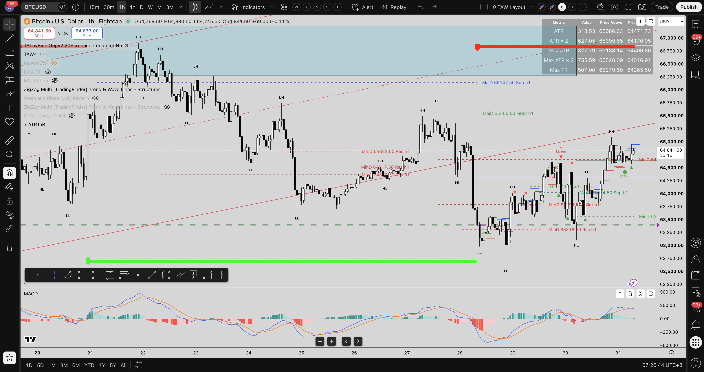

---

## 🕒 Intraday Update Run — [08:01 SGT]

### 📌 Session Update Overview
- **Total Active Alerts**: **101 Alerts** (41 Bearish vs 60 Bullish out of 101 total — 59.4% Bullish ratio).
- **Session Tone**: 🟢 **Strongly Bullish** (60 Bullish vs 41 Bearish).
- **Theme 1**: 🚀 **AUD Crosses Complete Bullish Alignment Sustained** — `AUDCHF`, `AUDCAD`, `AUDNZD`, `AUDUSD`, `AUDSGD`, `GBPAUD`, `EURAUD`, `XAUAUD`, `AUDJPY` aligning toward AUD sentiment.
- **Theme 2**: 📊 **Indices & Equity Sector Expansion** — `US30` (Dow Jones) logged fresh 1H Bullish alert at `07:00:10`, joining `US2000`, `NDQ100`, `SPX500`, `GER40` equity breakout momentum into Asian morning session.
- **Theme 3**: 🥇 **Metals Theme Intraday Retest** — `XAGUSD`, `XAUGBP` holding tactical 1H Bearish retest levels.
- **Theme 4**: 🪙 **Crypto Cluster Bullish Lead** — `BTCUSD` & `SOLUSD` (3 Bullish vs 0 Bearish).

---

### 🔄 Differences & Changes Highlights (vs 07:01 SGT Scan)

| Metric / Cluster | Previous Scan (07:01 SGT) | Current Scan (08:01 SGT) | Sentiment Shift & Structural Impact |
| :--- | :--- | :--- | :--- |
| **Total Alerts** | 101 Alerts | **101 Alerts** | Asian morning trading stream active |
| **Session Tone** | 🟢 Bullish (60 Bull vs 41 Bear) | 🟢 **Strong Bullish** (60 Bull vs 41 Bear) | **Bullish bias sustained (59.4%)** |
| **Indices Sector** | `US2000` Bullish | 🟢 **`US30` Bullish Added** | Dow Jones joining US small-cap & mega-cap index surge |
| **AUD Crosses** | 9 Pairs Bullish | 🟢 **Full Alignment Sustained** | AUD buyers maintaining control in Asian morning |

---

### 🎯 Active Trade Status at 08:01 SGT

1. 🔴 **[[AUDNZD]] Short**: **CLOSED / +112.7 PIPS PROFIT SECURED**.
2. 🟢 **[[GBPAUD]] Dual Long Positions**: Combined PnL **+66.3 pips net profit**. Hold with SL at BE (`1.9070` / `1.9100`), targeting `1.92632`.
3. 🟢 **[[EURAUD]] Long**: Live `1.64152` (**+47.4 pips profit**). Retesting `MajD 1.64112 FiRet h1` support. Hold with SL at BE (`1.6410`), target `1.64839`.

---

### 🟢 [[US30]] 1H Chart (Fresh Bullish Alert Captured)
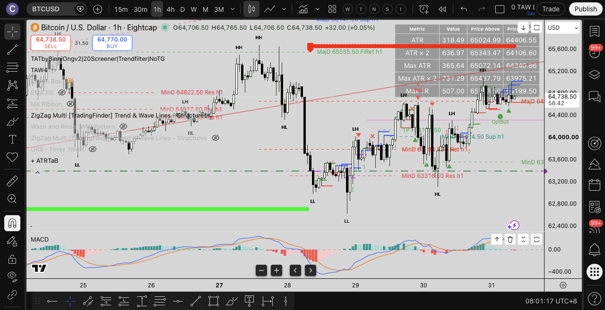

---

## 🕒 Intraday Update Run — [11:40 SGT]

### 📌 Session Summary (11:40 SGT)
- **Overall Session Sentiment**: 🟢 **Bullish** (12 Bullish vs 8 Bearish out of 20 total alerts — 60.0% Bullish ratio).
- **Primary Market Theme**: 🚀 **AUD Crosses Bullish Continuation** — AUD remains the **strongest bullish story** across `AUDNZD`, `AUDCHF`, `AUDCAD`.
- **Secondary Market Theme**: 🥇 **Metals Bearish Reversal** — Gold & Silver pairs (`XAUAUD`, `XAGUSD`, `XAUGBP`) fired **bearish**, a strong repeated signal.
- **DXY**: 💵 **DXY Bullish** — `USDX` fired bullish, indicating a potential USD strengthening narrative.
- **Cryptocurrency**: 🪙 `SOLUSD` fired **bearish** (1 alert).
- **Indices**: Mixed — `HK50`, `US30`, `US2000` leaning bearish (2 Bull vs 3 Bear out of 5).

### 🔄 Differences & Changes Highlights (vs 08:01 SGT Scan)

| Metric / Cluster | Previous Scan (08:01 SGT) | Current Scan (11:40 SGT) | Sentiment Shift & Structural Impact |
| :--- | :--- | :--- | :--- |
| **Total Alerts (Today)** | 101 Alerts | **20 New Alerts** | Asian morning flow tapering into midday |
| **Session Tone** | 🟢 Bullish (59.4%) | 🟢 **Bullish (60.0%)** | Bullish bias sustained |
| **AUD Crosses** | 9 Pairs Bullish | 🟢 **Sustained Bullish** | AUD buyers still dominant |
| **Metals Theme** | 🟢 Bullish | 🔴 **Bearish Reversal** | XAUAUD, XAGUSD, XAUGBP all fired bearish |
| **DXY** | 🔴 Bearish | 🟢 **Bullish Flip** | USDX fired bullish — potential USD recovery |
| **Crypto** | 🟢 Bullish (3B/0Be) | 🔴 **SOLUSD Bearish** | SOL weakness emerging |
| **Indices** | 🟢 Massive Bullish (13B/3Be) | 🟡 **Mixed (2B/3Be)** | Selective intraday pullbacks on HK50, US30, US2000 |

---

## 🕒 Intraday Update Run — [13:12 SGT]

### 📌 Session Summary (13:12 SGT)
- **New Alerts Analyzed**: `HK50`, `XAUAUD`, `EURUSD`, `SOLUSD`, `AUDNZD`, `USDSGD`, `USDX`, `AUDCHF`.
- **Primary Market Theme**: 🚀 **AUD Crosses Bullish Alignment** — `AUDNZD`, `AUDCHF`, `AUDCAD` maintaining strong bullish momentum.
- **Secondary Market Theme**: 🥇 **Metals Bearish Signal** — `XAUAUD`, `XAGUSD`, `XAUGBP` holding bearish signals.
- **DXY / USD**: 💵 **USDX & USDSGD Bullish** — USD Index and USD cross showing bullish intent.
- **Cryptocurrency**: 🪙 `SOLUSD` Bearish alert logged.

### 📸 New Alert Chart Screenshots

#### 🔴 [[HK50]] 1H Chart (Hong Kong Index Alert)
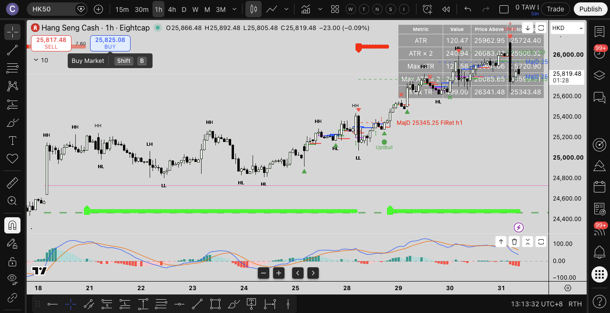

#### 🔴 [[XAUAUD]] 1H Chart (Gold / AUD Bearish Alert)
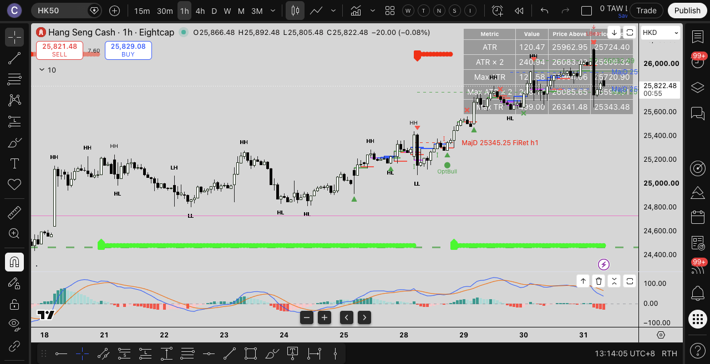

#### 🔴 [[SOLUSD]] 1H Chart (Solana Crypto Bearish Alert)
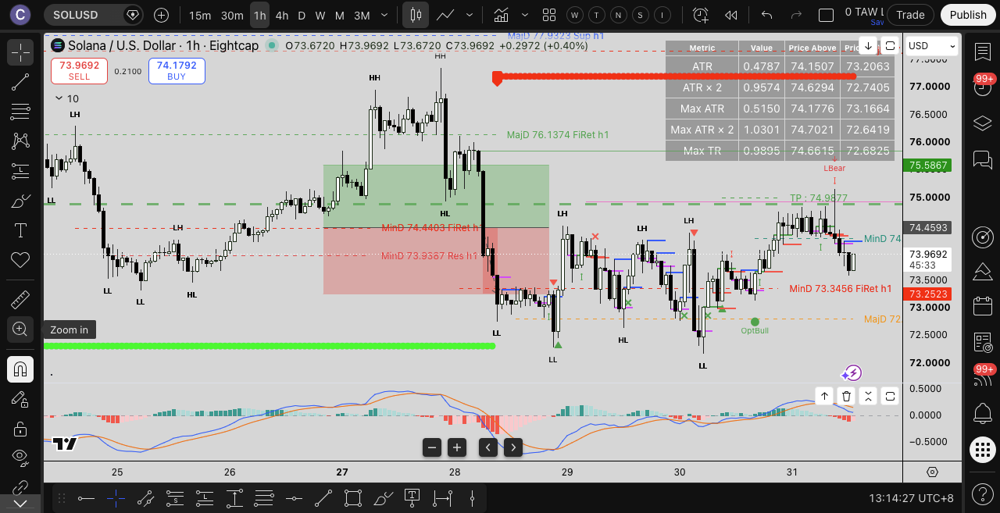

#### 🟢 [[EURUSD]] 1H Chart (Euro / Dollar Alert)
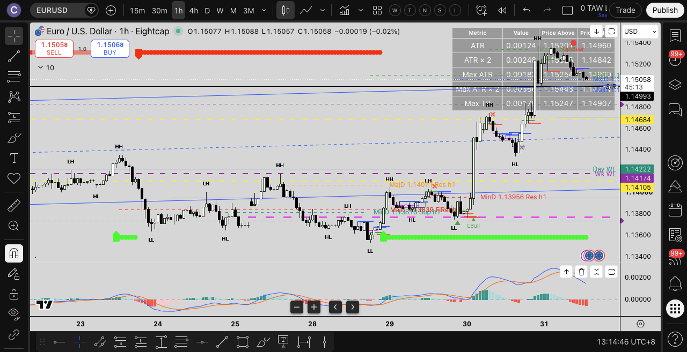

---

## 🕒 Intraday Update Run — [14:09 SGT]

### 📌 Session Summary (14:09 SGT)
- **Session Sentiment**: 🟢 **Bullish** (12 Bullish vs 8 Bearish out of 20 alerts — 60.0% Bullish ratio).
- **Primary Market Theme**: 🚀 **AUD Crosses Bullish Alignment** — `AUDNZD`, `AUDCHF`, `AUDCAD` maintaining strong bullish momentum.
- **Secondary Market Theme**: 🥇 **Metals Bearish Signal** — `XAUAUD`, `XAGUSD`, `XAUGBP` holding bearish signals.
- **DXY / USD**: 💵 **USDX & USDSGD Bullish** — USD Index and USD cross showing bullish intent.
- **Cryptocurrency**: 🪙 `SOLUSD` Bearish alert logged.

### 🔄 Differences & Changes Highlights (vs 13:12 SGT Scan)

| Metric / Cluster | Previous Scan (13:12 SGT) | Current Scan (14:09 SGT) | Sentiment Shift & Structural Impact |
| :--- | :--- | :--- | :--- |
| **Total Alerts (Today)** | 20 Alerts | **20 Alerts** | Midday Asian consolidation phase |
| **Session Tone** | 🟢 Bullish (60.0%) | 🟢 **Bullish (60.0%)** | Unchanged session bias |
| **AUD Crosses** | 🟢 Bullish | 🟢 **Sustained Bullish** | Buyer control holding into London prep |
| **Metals / Crypto** | 🔴 Bearish | 🔴 **Bearish Retest Holding** | `XAUAUD` & `SOLUSD` maintaining bearish levels |

---

### 📸 New 4H Alert Chart Screenshots (4H Tab)

#### 🔴 [[SGDJPY]] 4H Chart (SGD / JPY Alert)
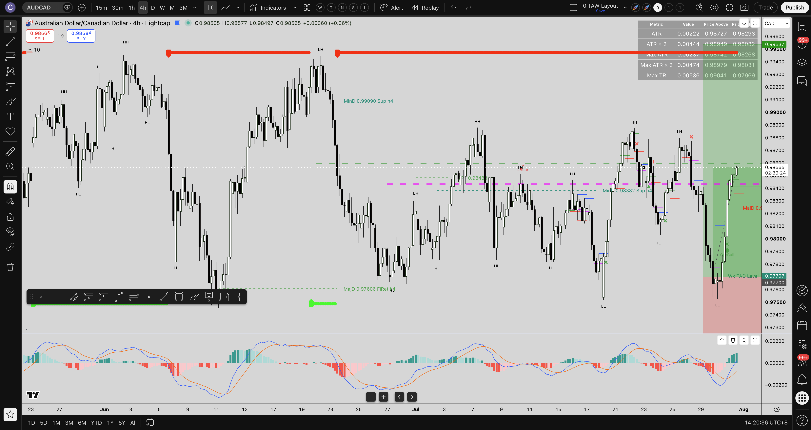

#### 🔴 [[CADJPY]] 4H Chart (CAD / JPY Alert)
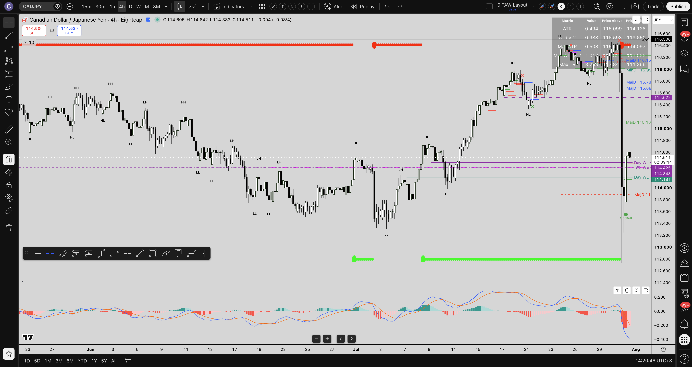

#### 🔴 [[USDJPY]] 4H Chart (USD / JPY Alert)
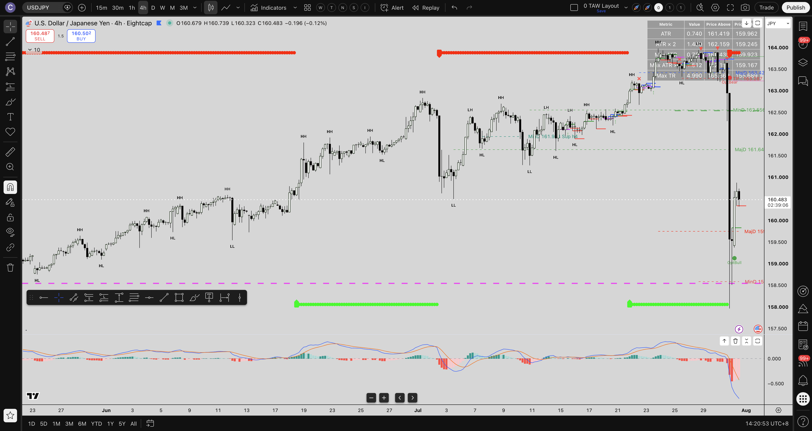

#### 🔴 [[CHFJPY]] 4H Chart (CHF / JPY Alert)
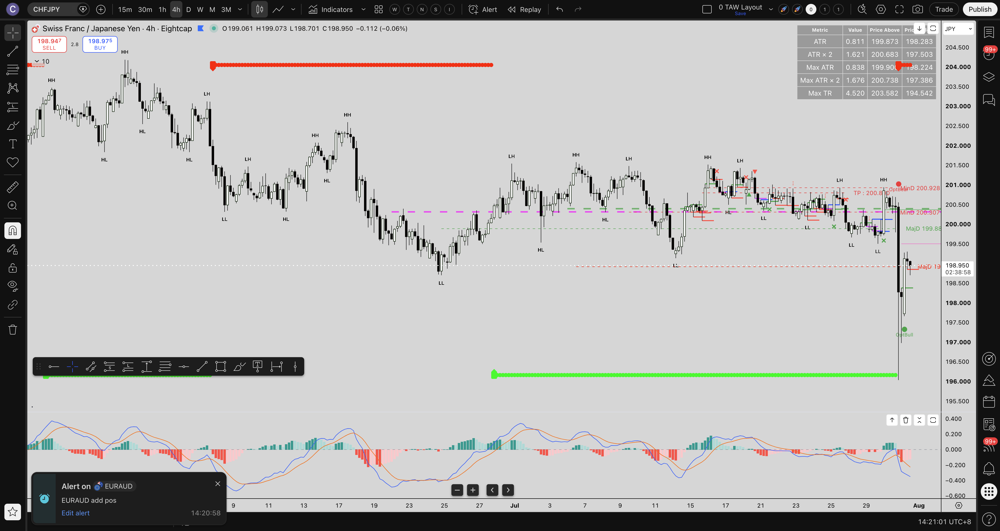

---

## 🕒 Intraday Update Run — [16:01 SGT] (London Session Open Scan)

### 📌 Session Summary (16:01 SGT)
- **Session Sentiment**: 🟢 **Bullish** (15 Bullish vs 9 Bearish out of 24 total alerts — 62.5% Bullish ratio).
- **Primary Market Theme**: 🚀 **Swiss Franc (CHF) Weakness Sweep** — `GBPCHF`, `AUDCHF`, `USDCHF` all fired **Bullish / OptBull / LBull** at 14:00 SGT as CHF weakened across major currency pairs.
- **Secondary Market Theme**: 💵 **USD Rebound & EUR Softness** — `EURUSD` fired **Bearish** (`SBear` at 1.15059, Support Zone Upper Boundary Broken).
- **AUD Crosses**: 🟢 **Sustained Bullish Story** — `AUDCHF` (`OptBull`), `AUDNZD`, `AUDCAD` maintaining strong buyer momentum.

### 🔄 Differences & Changes Highlights (vs 14:09 SGT Scan)

| Metric / Cluster | Previous Scan (14:09 SGT) | Current Scan (16:01 SGT) | Sentiment Shift & Structural Impact |
| :--- | :--- | :--- | :--- |
| **Total Alerts (Today)** | 20 Alerts | **24 Alerts (+4 New)** | London Open volatility surge |
| **Session Tone** | 🟢 Bullish (60.0%) | 🟢 **Bullish (62.5%)** | Bullish sentiment expanded |
| **CHF Crosses** | Neutral | 🔴 **CHF Weakness Sweep** | `GBPCHF`, `AUDCHF`, `USDCHF` all fired Bullish |
| **EURUSD** | 🟢 Bullish (10:00 SGT) | 🔴 **Bearish Flip (14:00 SGT)** | Fired `SBear` at 1.15059 (Support Broken) |
| **USD** | 🟢 Bullish (`USDX`) | 🟢 **Sustained Strength** | `USDCHF` Bullish, `EURUSD` Bearish |

---

### 📸 New 1H Alert Chart Screenshots (London Session Open - 14:00 SGT Alerts)

#### 🟢 [[GBPCHF]] 1H Chart (GBP / CHF Bullish Breakout Alert — 14:00:14 SGT `LBull`)
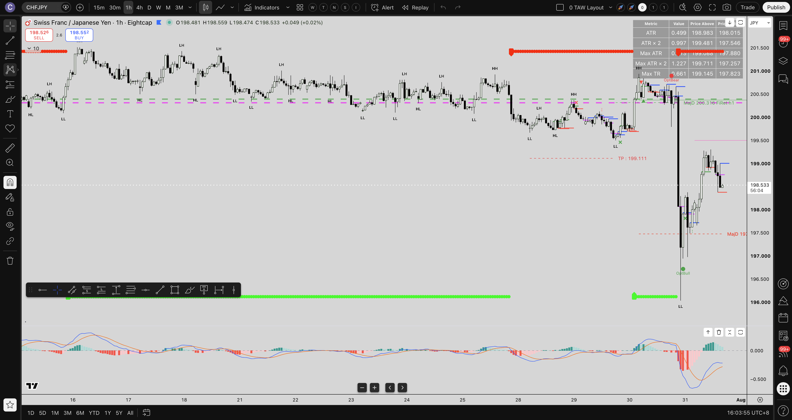

#### 🟢 [[AUDCHF]] 1H Chart (AUD / CHF Bullish Retracement Alert — 14:00:11 SGT `OptBull`)
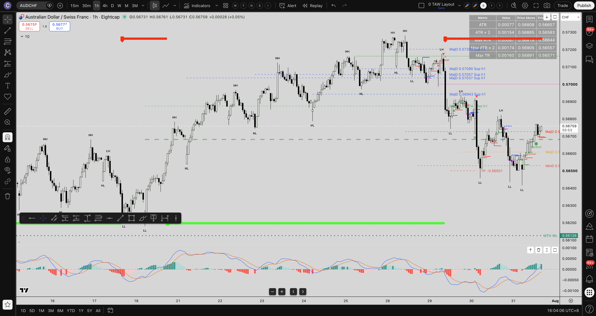

#### 🟢 [[USDCHF]] 1H Chart (USD / CHF Bullish Retracement Alert — 14:00:10 SGT `OptBull`)
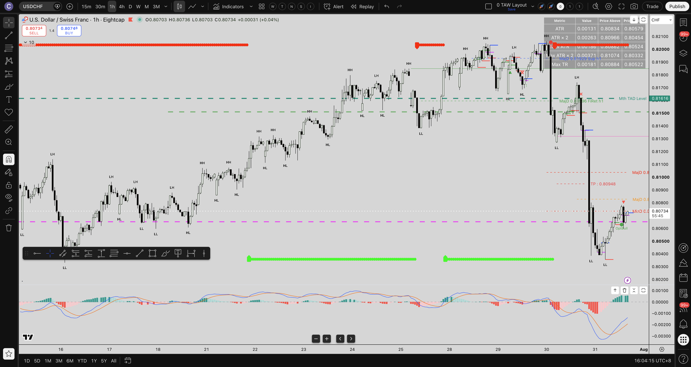

#### 🔴 [[EURUSD]] 1H Chart (EUR / USD Bearish Breakout Alert — 14:00:04 SGT `SBear`)
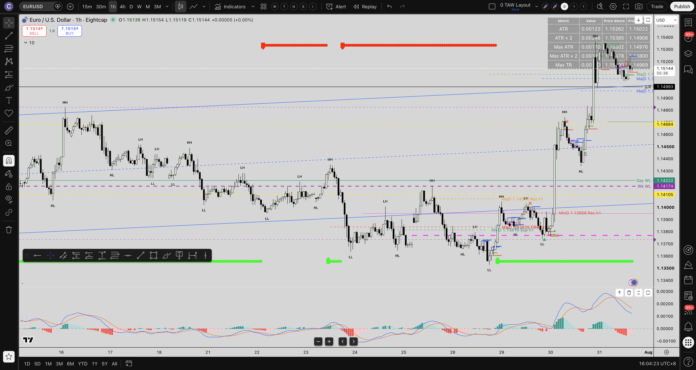

---

## 🕒 Intraday Update Run — [17:12 SGT] (London Mid-Session Scan)

### 📌 Session Summary (17:12 SGT)
- **Session Sentiment**: 🟢 **Bullish** (15 Bullish vs 11 Bearish out of 26 total alerts — 57.7% Bullish ratio).
- **Primary Market Theme**: 🥇 **Gold (XAUUSD) Bearish Retracement Breakout** — `XAUUSD` fired **Bearish** (`OptBear` at `4068.49`, Bearish First Retracement Level Broken) at 16:01:05 SGT, strengthening the **Metals Bearish Reversal Theme** across `XAUUSD`, `XAUAUD`, `XAGUSD`, `XAUGBP`.
- **Secondary Market Theme**: 🔄 **GBPCHF Intraday Directional Flip** — `GBPCHF` flipped from `LBull` (14:00 SGT) to `OptBear` (`1.08484`, First Retracement Level Broken) at 15:00:07 SGT.

### 🔄 Differences & Changes Highlights (vs 16:01 SGT Scan)

| Metric / Cluster | Previous Scan (16:01 SGT) | Current Scan (17:12 SGT) | Sentiment Shift & Structural Impact |
| :--- | :--- | :--- | :--- |
| **Total Alerts (Today)** | 24 Alerts | **26 Alerts (+2 New)** | London Mid-Session expansion |
| **Session Tone** | 🟢 Bullish (62.5%) | 🟢 **Bullish (57.7%)** | Slight pullback in bullish dominance |
| **Gold / Metals** | 🔴 Bearish (`XAUAUD`) | 🔴 **XAUUSD Bearish Breakdown** | `XAUUSD` fired `OptBear` at 4068.49 |
| **GBPCHF** | 🟢 Bullish (`LBull`) | 🔴 **Bearish Flip** | Fired `OptBear` at 1.08484 (First Retracement Broken) |

---

### 📸 New 1H Alert Chart Screenshots (London Mid-Session - 15:00 & 16:01 SGT Alerts)

#### 🔴 [[XAUUSD]] 1H Chart (Gold / US Dollar Bearish Retracement Alert — 16:01:05 SGT `OptBear` at 4068.49)
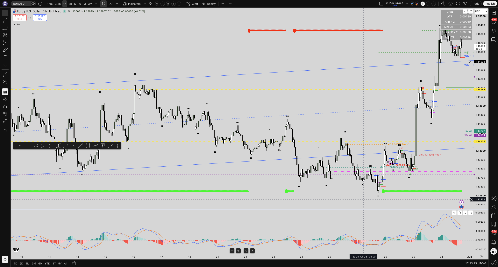

#### 🔴 [[GBPCHF]] 1H Chart (GBP / CHF Bearish Retracement Alert — 15:00:07 SGT `OptBear` at 1.08484)
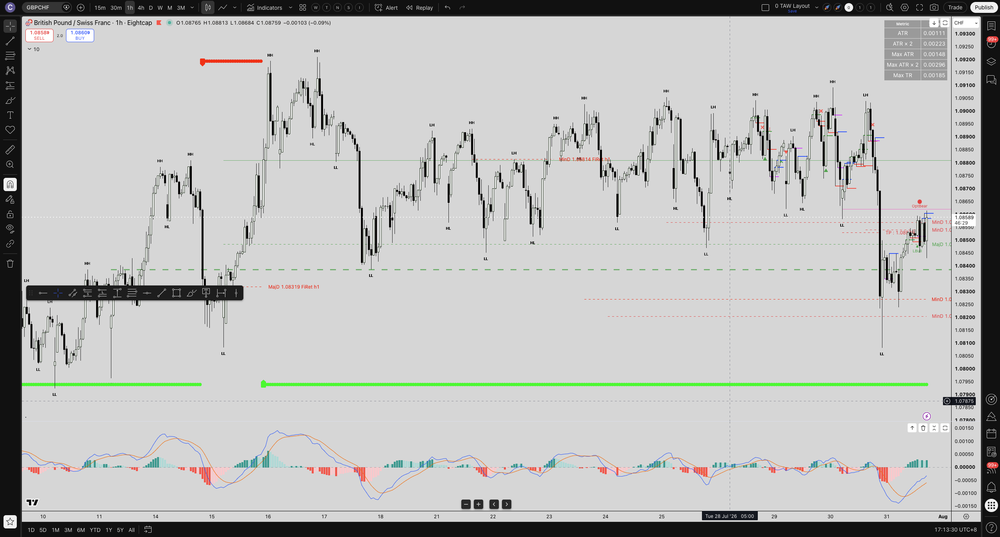

