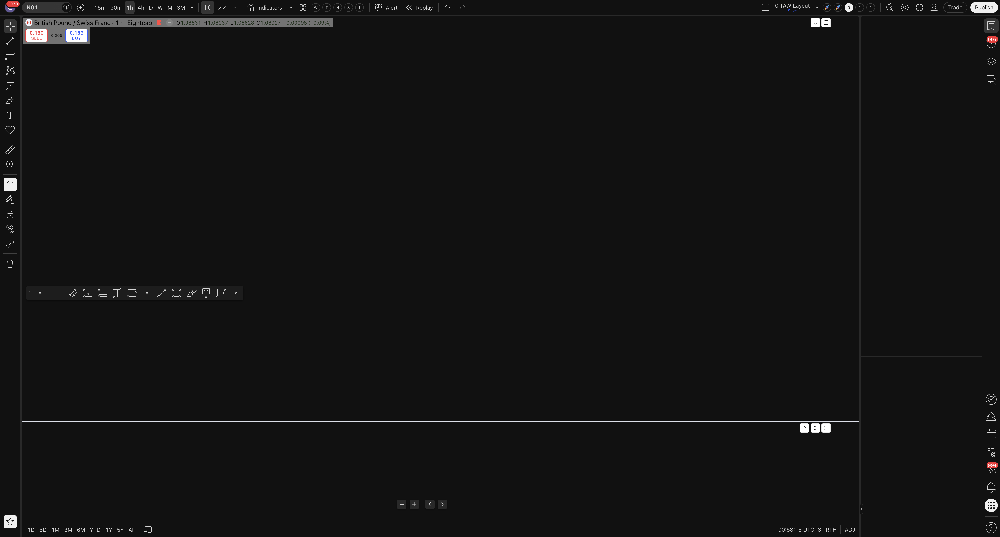
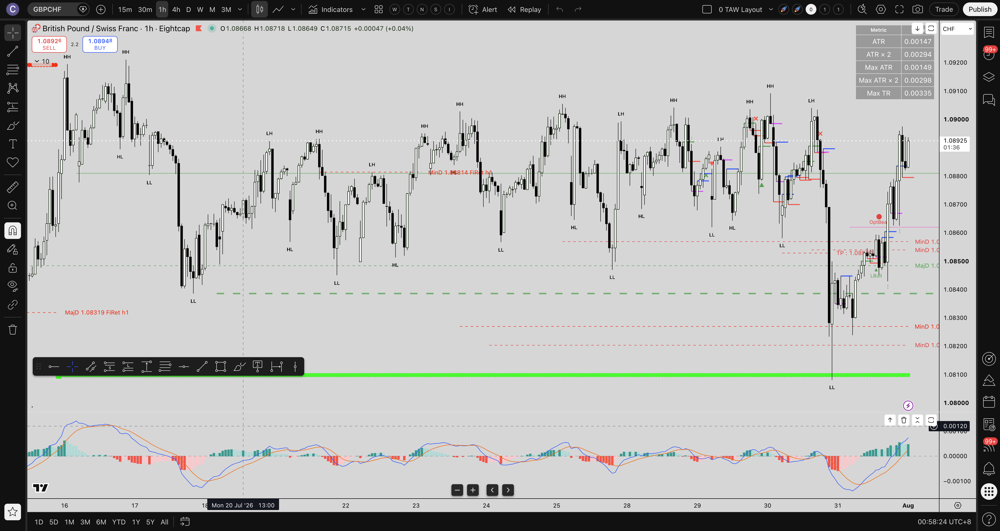
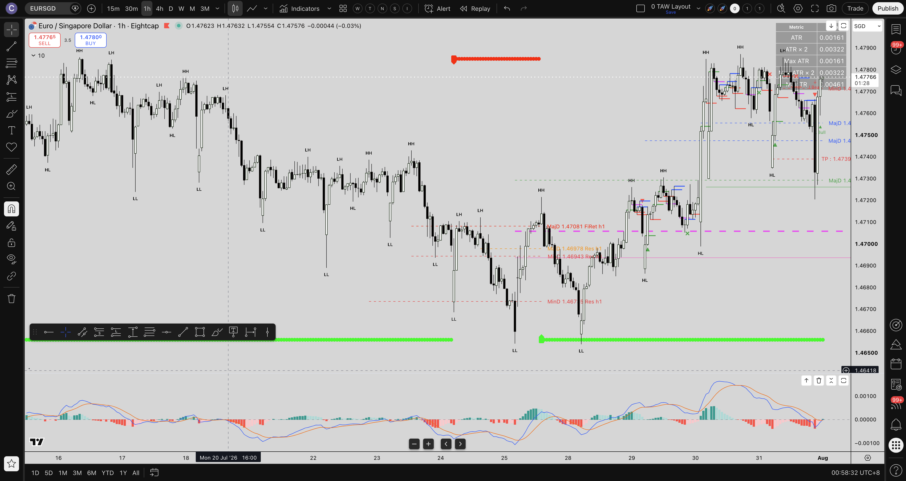
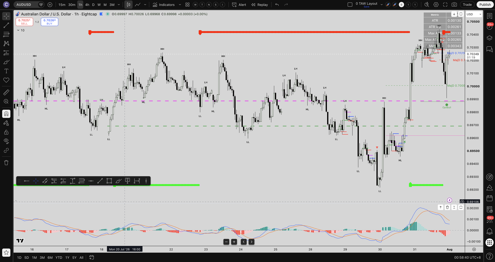
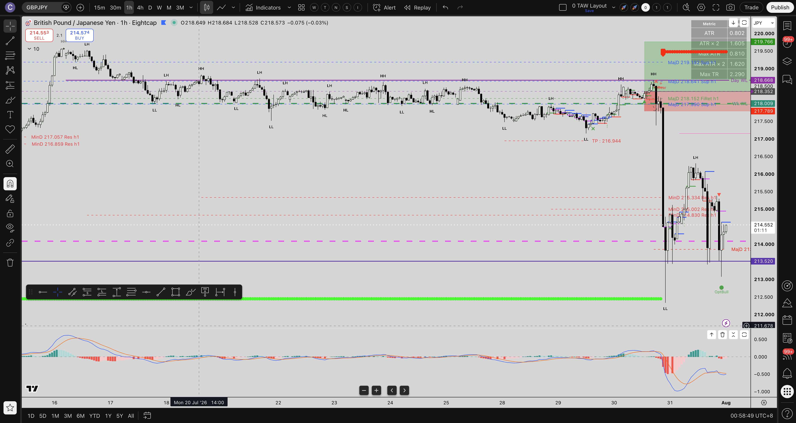
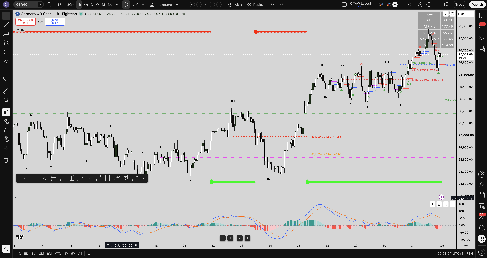

# 📈 1H TAT Analysis Report — 2026-08-01 [00:57 SGT]

## 📌 Executive Overview

- **Report Date & Time**: 2026-08-01 [00:57 SGT]
- **Overall Session Sentiment**: 🟢 **Bullish** (33 Bullish vs 26 Bearish out of 59 total alerts — 55.9% Bullish ratio).
- **Primary Market Theme**: 🚀 **US Index Bullish Recovery & Equity Sector Divergence** — `US30` fired **Bullish** (`OptBull`, Bullish First Retracement Level Broken at 00:00:20 SGT), while European indices (`GER40`) and metals (`XAUUSD`) broke support.
- **Secondary Market Theme**: 🛢️ **Crude Oil (USOUSD) Bearish Breakdown** — `USOUSD` fired **Bearish** (`LBear`, Support Zone Fully Broken at 00:00:13 SGT).
- **Forex Momentum**: 🟢 **EURSGD & AUDUSD Bullish Breakouts** — `EURSGD` (`LBull` at 00:00:09 SGT) and `AUDUSD` (`OptBull` at 23:00:22 SGT) confirming AUD/EUR buyer strength. `USDCAD` broke support (`LBear`).

---

## 🔄 Differences & Changes Highlights (vs 2026-07-31 17:12 SGT Scan)

| Metric / Cluster | Previous Scan (2026-07-31 17:12 SGT) | Current Scan (2026-08-01 00:57 SGT) | Sentiment Shift & Structural Impact |
| :--- | :--- | :--- | :--- |
| **Total Alerts (Today)** | 26 Alerts | **59 Alerts (+33 New)** | New trading day volatility surge |
| **US Equities (`US30`)** | Mixed / Consolidation | 🟢 **Bullish Breakdown Reversal** | `US30` fired `OptBull` (First Retracement Broken) |
| **Energy (`USOUSD`)** | Neutral | 🔴 **Bearish Breakdown** | `USOUSD` fired `LBear` (Support Zone Broken) |
| **EURSGD / AUDUSD** | Neutral | 🟢 **Bullish Breakouts** | `EURSGD` `LBull`, `AUDUSD` `OptBull` |
| **USDCAD** | Inconsistent | 🔴 **Bearish Breakdown** | `USDCAD` fired `LBear` (Support Zone Broken) |

---

## 📸 New Alert Chart Screenshots

### 🟢 [[US30]] 1H Chart (US Wall Street 30 Bullish Retracement Alert — 00:00:20 SGT `OptBull`)

### 🔴 [[USOUSD]] 1H Chart (Crude Oil Bearish Breakdown Alert — 00:00:13 SGT `LBear`)

### 🟢 [[EURSGD]] 1H Chart (Euro / Singapore Dollar Bullish Breakout Alert — 00:00:09 SGT `LBull`)

### 🟢 [[AUDUSD]] 1H Chart (Aussie / Dollar Bullish Retracement Alert — 23:00:22 SGT `OptBull`)

### 🟢 [[GBPJPY]] 1H Chart (Pound / Yen Bullish Retracement Alert — 23:00:17 SGT `OptBull`)

### 🔴 [[GER40]] 1H Chart (German Dax 40 Bearish Breakdown Alert — 22:15:19 SGT `LBear`)

---

## 📚 Bookkeeping Discipline Applied

- **Report Filed**: `wiki/reports/tat_analysis/2026-08-01-1h-tat-alert-analysis-report.md`
- **Images Saved in `wiki/images/`**:
  - `260801-005754_us30_1h_chart.png` ([view](file:///Users/chriseah/obsidian/wiki-trades/wiki/images/260801-005754_us30_1h_chart.png))
  - `260801-005816_usousd_1h_chart.png` ([view](file:///Users/chriseah/obsidian/wiki-trades/wiki/images/260801-005816_usousd_1h_chart.png))
  - `260801-005824_eursgd_1h_chart.png` ([view](file:///Users/chriseah/obsidian/wiki-trades/wiki/images/260801-005824_eursgd_1h_chart.png))
  - `260801-005833_audusd_1h_chart.png` ([view](file:///Users/chriseah/obsidian/wiki-trades/wiki/images/260801-005833_audusd_1h_chart.png))
  - `260801-005841_gbpjpy_1h_chart.png` ([view](file:///Users/chriseah/obsidian/wiki-trades/wiki/images/260801-005841_gbpjpy_1h_chart.png))
  - `260801-005850_ger40_1h_chart.png` ([view](file:///Users/chriseah/obsidian/wiki-trades/wiki/images/260801-005850_ger40_1h_chart.png))
